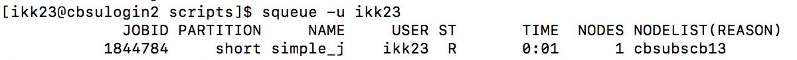

```{r setup, include=FALSE}
knitr::opts_chunk$set(echo = TRUE)
```


## Resources

* [BSCB cluster guide](https://biohpc.cornell.edu/lab/cbsubscb_SLURM.htm)
* [Slurm introduction by Princeton Research Computing](https://researchcomputing.princeton.edu/slurm)
* [Introduction to slurm in the Bioinformatics Workbook](https://bioinformaticsworkbook.org/Appendix/Unix/01_slurm-basics.html#gsc.tab=0)
* [Slurm overview](https://slurm.schedmd.com/overview.html)
* [Slurm commands reference sheet](https://slurm.schedmd.com/pdfs/summary.pdf)
* [Recordings of past BioHPC workshops](https://biohpc.cornell.edu/login_bio.aspx?ReturnURL=/lab/medialist.aspx)

## Cluster structure


<br>

#### Login nodes

* There are three login nodes: `cbsulogin`, `cbsulogin2`, and `cbsulogin3`.
* They are used for submitting jobs or requesting interactive sessions.
* Use `ssh` to connect to login nodes (Cornell VPN is not necessary).
    * They all have the domain name `cbsulogin.biohpc.cornell.edu`.
    * E.g. `ssh netid@cbsulogin.biohpc.cornell.edu`
* Don't use them for computation.

#### Computing nodes

General Info

* Currently, there are a total of 16 computing nodes, which are named `cbsubscb01`-`cbsubscb15`, and `cbsubscbgpu01`.
* Their specs range from 32-56 in physical cores, and 256-512GB in RAM.
* You can access these computing nodes from the login node, by submitting a job using `sbatch` OR by requesting an interactive session using `salloc`
* Each node can also be accessed directly though `ssh`
* You can't run computationally intensive jobs in these sessions. 
    + This is only for tasks such as job submission, interactive session request, file lookup, and monitoring.
* Unlike the login nodes, accessing the computing nodes directly will require Cornell network connect (i.e. VPN if you are off campus).

* Local storage on computing nodes
	  * Each computing node has a local permanent storage and each is assigned to a different lab group.
	  * The local storage of each node is located at the directory `/local/storage`.
	  * The local storage of each node can be mounted to any other node using the command `/programs/bin/labutils/mount_server node_name /storage`. 
	      * e.g. `/programs/bin/labutils/mount_server cbsubscb04 /storage`
    * The mounted storage then becomes available under the directory `/fs/node_name/storage/`
	  * This mounting step is usually one of the first things we do in a job script so that your input files can be accessed from any of the computing nodes.

* Scratch storage on computing nodes
	  * Each computing node has a scratch storage, ranging from 1-2TB in capacity.
	  * They are located under `/workdir/` (and `/SSD/` on some nodes). 
	  * It is recommended to copy your input files from network mounted storage space to this scratch storage for computing, espcially for I/O heavy jobs.
	  * The scratch storage is shared by all users, so after you finish your job, make sure to copy your output files to your permanent storage space, and clear the scrach storage space. 
	  * Any files that were not removed by users will be removed automatically when the node receives a new job.
	  * Users who have jobs running on the nodes will **not** have their associated files removed from the scratch space.

#### Storage servers

* There are three storage servers, which together have a capcity of 281TB.
* They should not be accessed directly. 
* Instead, they are network mounted in all BSCB machines under `/bscb/`, in which each lab group has a subfolder.
* They are not mounted to the `nt246` server yet. 

#### Home directory

* You will always have the same home directory. It is mounted on all CBSU servers.
* It has limited storage space and should not be used for computing or storage.

## Cluster partitions

| Partition | Job Time Limit | Nodes                          | Slots                    |
|-----------|----------------|--------------------------------|--------------------------|
| short     | 4 hours        | cbsubscb[01-15], cbsubscbgpu01 | 1136                     |
| regular   | 24 hours       | cbsubscb[01-15], cbsubscbgpu01 | 348                      |
| long7     | 7 days         | cbsubscb[01-15]                | 352                      |
| long30    | 30 days        | cbsubscb[01-15]                | 416 (limit 270 per user) |
| gpu       | 3 days         | cbsubscbgpu01                  | 32 + 2 GPUs              |

* Any jobs submitted from the login node will get to a queue.
* The cluster has five different queues (or partitions), and each has a different time limit (see the table above).
* The partition to which a job is submitted can be specified by the `--partition` or `-p` option, with default being the `short` partition.
* Generally, the longer the time limit a partition has, the longer you might have to wait in the queue.
* Note that there are a total of 1136 slots (i.e. number of tasks that can be requested). So all slots are available for jobs submitted to the `short` partition, and only a subset of them are available for other partitions. 

## Computing

#### General rules

* Don't do any computing directly on the login nodes or computing nodes (if you do, you'll get angry emails). 
    * Instead, either write everything in a script that you submit using `sbatch`, or request an interactive session using `salloc`.
* It is also not recommended to do computing directly (i.e. read or write) with files that are network-mounted (i.e. `/fs/`, `/cbsu/`, `/home/`), especially for jobs that are heavy in I/O.
    * Instead, start by creating a temporary directory under `/workdir/`
    * Then, copy all the files you will need from the network mounted storage space into the temporary directory. 
    * Perform computation with files in the temporary directory.
    * Copy all desired output from the temporary directory to your home directory.
    * Delete the temporary directory at the end.
    * Below is an example of this workflow.

```{bash eval = FALSE, include = TRUE}
# Create and move to a working directory for job
WORKDIR=/SSD/$USER/$JOB_ID-$SLURM_ARRAY_TASK_ID
mkdir -p $WORKDIR
cd $WORKDIR

# Copy files to working directory
BASE_DIR=/home/ikk23
cp $BASE_DIR/slim_files/merged_same_site_spatial.slim .
cp $BASE_DIR/python_scripts/new_driver.py .

# Run program
python new_driver.py > ${SLURM_ARRAY_TASK_ID}.part

# Copy files back to home directory
cp ${SLURM_ARRAY_TASK_ID}.part $BASE_DIR/zpg_output

# Clean up working directory
rm -r $WORKDIR
```

#### Slurm submission options

Various options can be specified to control the various aspects of computing on a Slurm cluster. There are two ways to do this:

**1. Through `#SBATCH` headers at the beginning of the shell script.**

The following example contains the most useful headers. You will need to delete the text within parentheses if you want to use this as a template. 

```{bash eval = FALSE}
#!/bin/bash -l                   (change the default shell to bash; '-l' ensures your .bashrc will be sourced in, thus setting the login environment)
#SBATCH --nodes=1                (number of nodes, i.e., machines; all non-MPI jobs *must* run on a single node, i.e., '--nodes=1' must be given here)
#SBATCH --ntasks=8               (number of tasks; by default, 1 task=1 slot=1 thread)
#SBATCH --mem=8000               (request 8 GB of memory for this job; default is 1GB per job; here: 8)
#SBATCH --time=1-20:00:00        (wall-time limit for job; here: 1 day and 20 hours)
#SBATCH --partition=long7,long30  (request partition(s) a job can run in; here: long7 and lon30 partition)
#SBATCH --account=bscb09         (project to charge the job to; you should be a member of at least one of 6 projects: ak735_0001,bscb01,bscb02,bscb03,bscb09,bscb10)
#SBATCH --chdir=/home/bukowski/slurm   (start job in specified directory; default is the directory in which sbatch was invoked)
#SBATCH --job-name=jobname             (change name of job)
#SBATCH --output=jobname.out.%j  (write stdout+stderr to this file; %j willbe replaced by job ID)
#SBATCH --mail-user=email@address.com          (set your email address)
#SBATCH --mail-type=ALL          (send email at job start, end or crash - do not use if this is going to generate thousands of e-mails!)
```

When the script is ready, you can save it as `submit.sh`, for example, and submit it with `sbatch submit.sh`.

Note that this option is only application for `sbatch`, but not `salloc`.

**2. By appending the options after `sbatch` or `salloc` on command line.**

For example,

```{bash eval = FALSE}
sbatch --job-name=somename --nodes=1 --ntasks=6 --mem=4000 submit.sh
```

or 

```{bash eval = FALSE}
salloc --nodes=1 --ntasks=6 --mem=4000
```

This option works for both `sbatch` and `salloc`. Also, note that the command line options will override the `#SBATCH` headers, so it might be a good practice to use the headers as default settings and tweak them with command line when needed.

Some other slurm options not specified in above exmaples include:

* `--nodelist`: computing nodes that you want your jobs to run on. E.g.`--nodelist=cbsubscb12`
* `--exclude`: computing nodes that you **don't** want your jobs to run on. E.g. `--exclude=cbsubscb10,cbsubscbgpu01`

#### Job monitoring

* `sinfo` : report the overall state of the cluster and queues
* `scontrol show nodes` : report detailed information about the cluster nodes, including current usage
* `scontrol show partitions` : report detailed information about the queues (partitions)
* `squeue` : show jobs running and waiting in queues
* `squeue -u abc123` : show jobs belonging to user abc123
* `scancel 1564` : cancel job with jobID 1564. All processes associated with the job will be killed
* `slurm_stat.pl cbsubscb`: summarize current usage of nodes, partitions, and slots, and number of jobs per user (run on one of the login nodes)
* `get_slurm_usage.pl`: generate information about average duration, CPU, and memory usage of your recent jobs (run the command without arguments to see usage) - this may help assess real memory needs of your jobs and show whether all requested CPUs are actually used.

#### A simple example of job submission using `sbatch`

`simple_example.sh` merges 365 fasta files into 1.

```{bash}
cat simple_example.sh
```
Job headers:

* `#SBATCH --time=10:00` : set a time limit of 10 minutes
* `#SBATCH --partition=short` : use the **short** queue, since this job will take less than 4 hours
* `#SBATCH --job-name=simple_job` : this is the name that will appear in `squeue`
* `#SBATCH --output=simple_job.out` : direct error messsages to this file, which will be placed in the working directory from which you submitted the job

Submit this job with:  `sbatch simple_example.sh`

* You can include job headers here instead. For example, I could have omitted the headers above and instead done `sbatch simple_example.sh -t 10:00 -p short -J simple_job -o simple_job.out`
* Once you submit your job, you'll get a message that includes the job number 
  + ex: `Submitted batch job 1844784`

You can view the status of your jobs with: `squeue -u netid`

* This should look something like: 



* If you'd rather be notified via email at the job start, end, or crash, include headers `#SBATCH --mail-user=email@address.com` and `#SBATCH --mail-type=ALL`

Kill your job with: `scancel jobnumber`

#### Job arrays

* If you want to run an identical program 10 times, instead of using a for-loop, you can submit the script as a job array of length 10. This is controlled by the header: `#SBATCH --array=1-10`
* Each array job will get its own unique ID, `SLURM_ARRAY_TASK_ID`, that you can make use of in your script.
* If you want each job in a 1-10 array to run something different, you can create a text file with 10 lines and have each line specify the command you want to run.
  + Make sure to copy this text file over to the temporary working directory!
  + In the shell script, write: 
```{bash eval=F, include=T}
# go to the <SLURM_ARRAY_TASK_ID> line of the job_parameters.txt file
# and run this command
# for example, this line could read `python my_script.py 4`
prog=`sed -n "${SLURM_ARRAY_TASK_ID}p" job_parameters.txt`
$prog > output${SLURM_ARRAY_TASK_ID}.out
```
  + If this is the 3rd job in the job array, then the command on the 3rd line of `job_parameters.txt` will be run
  + Remember to copy the output back to your home directory before deleting the temporary working directory!


###### Example - running SLiM jobs on the cluster

* SLiM file: `merged_same_site_spatial.slim`

* Python driver: `new_driver.py`
  + This runs each SLiM simulation `-nreps` times, parses the output, and writes the desired results to a csv file that will be copied back to my home directory.

* Text file with commands: `slim_job_params.txt`

* Shell script that I'll submit to SLURM: `slim_job.sh`
  + This is an array of length 7.
  + I use the SLURM_ARRAY_TASK_ID environmental variable to grab a specific line of my param txt file. Each line will tells Python to modify my SLiM file to simulate a specific promoter. 
    + For example, the 2nd array job will run `python new_driver.py -d zpgX -nreps 2 -header`, which simulates a zpgX promoter 2 times and creates a csv file with 2 lines (`slim_result_2.csv`)

```{bash}
cat slim_job.sh
```


## Remaining Questions

* Can `nt246` be network mounted to BSCB nodes?
* Do you have access to the storage servers?
* Can the storage server be network mounted to `nt246`?
* How to backup files in permant storage locations?
* How to run RStudio Server?
* How to know RAM requirement before running jobs?